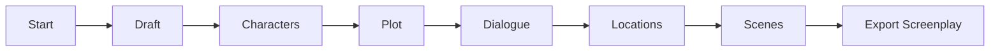
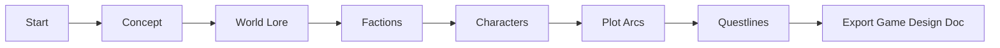

# API Server Comparison: ArcueAgent vs SagaAgent

This document compares the two API servers in this repository and helps you choose which one to use.

## Quick Reference

| Feature | ArcueAgent (`api_server.py`) | SagaAgent (`saga_api_server.py`) |
|---------|------------------------------|-----------------------------------|
| **Purpose** | Screenplay/Film Generation | Game Narrative Generation |
| **Default Port** | 8000 | 8001 |
| **Output Format** | Screenplays, Scenes, Dialogue | Concepts, Quests, Characters, Lore |
| **Workflow Stages** | 6 stages | 6 stages |
| **Parallel Execution** | ❌ No | ✅ Yes (40-50% faster) |
| **Target Use Case** | Film/TV Production | Video Game Development |

---

## ArcueAgent API (`api_server.py`)

### Overview
REST API for **screenplay and film script generation** using ArcueAgent.

### Workflow Stages
1. **Draft** - Initial screenplay draft
2. **Characters** - Character development
3. **Plot** - Plot points and structure
4. **Dialogue** - Dialogue scenes
5. **Locations** - Location descriptions
6. **Scenes** - Complete scene breakdowns

### Key Features
- Film/TV screenplay generation
- Scene-by-scene breakdown
- Dialogue optimization
- Location scouting descriptions
- Visual lookbook generation
- Industry-standard screenplay format

### Best For
- Screenwriters
- Film producers
- TV show developers
- Short film creators
- Documentary planners

### Example Request
```json
{
  "topic": "A thriller about AI consciousness",
  "research_required": "not_required",
  "film_length_seconds": 90,
  "number_of_scenes": 12
}
```

### Example Output
- Screenplay draft with acts
- Character profiles
- Plot points (inciting incident, midpoint, climax)
- Dialogue scenes
- Location descriptions
- Scene breakdowns with action/dialogue

---

## SagaAgent API (`saga_api_server.py`)

### Overview
REST API for **game narrative generation** using SagaAgent.

### Workflow Stages
1. **Concept** - Game concept document
2. **World Lore** - World-building and setting
3. **Factions** - Organizations and groups
4. **Characters** - NPCs and companions
5. **Plot Arcs** - Story arcs and campaigns
6. **Questlines** - Missions and quests

### Key Features
- Game design document generation
- Rich world-building and lore
- Faction systems with relationships
- Character creation (NPCs, companions)
- Branching narrative design
- Quest structure with objectives
- **Parallel execution** for faster generation

### Best For
- Game designers
- Narrative designers
- RPG developers
- World builders
- Quest designers
- Indie game developers

### Example Request
```json
{
  "topic": "A dark fantasy RPG with Norse mythology",
  "research_required": "not_required",
  "parallel_execution": true,
  "parallel_max_workers": 3
}
```

### Example Output
- Game concept (pitch, mechanics, USP)
- World lore (geography, history, cultures)
- Factions (guilds, kingdoms, organizations)
- Characters (personality, backstory, mechanics)
- Plot arcs (3-act structure, branching paths)
- Questlines (objectives, rewards, choices)

---

## Feature Comparison

### Research Integration
Both support research agent integration for grounding narratives in real-world information.

| | ArcueAgent | SagaAgent |
|---|------------|-----------|
| Research Integration | ✅ Yes | ✅ Yes |
| Research Use Case | Historical events, real locations | Game mechanics, cultural research |

### Model Support
Both support OpenAI and Google models.

| | ArcueAgent | SagaAgent |
|---|------------|-----------|
| OpenAI Models | ✅ GPT-4, GPT-3.5 | ✅ GPT-4, GPT-3.5 |
| Google Models | ✅ Gemini | ✅ Gemini |
| Custom Model Config | ✅ Yes | ✅ Yes |

### Workflow Control
Both support human-in-the-loop workflows with feedback at each stage.

| | ArcueAgent | SagaAgent |
|---|------------|-----------|
| Stage-by-Stage Review | ✅ Yes | ✅ Yes |
| Feedback Loop | ✅ Yes | ✅ Yes |
| Regenerate with Feedback | ✅ Yes | ✅ Yes |
| Auto-Continue Mode | ✅ Yes | ✅ Yes |

### Export Formats
Both support JSON and Markdown exports.

| | ArcueAgent | SagaAgent |
|---|------------|-----------|
| JSON Export | ✅ Yes | ✅ Yes |
| Markdown Export | ✅ Yes | ✅ Yes |
| Export Structure | Scene-based | Component-based |

### Performance
| | ArcueAgent | SagaAgent |
|---|------------|-----------|
| Parallel Execution | ❌ No | ✅ Yes |
| Speed Improvement | - | 40-50% faster |
| Checkpoint Support | ✅ Yes | ✅ Yes |
| Session Management | ✅ In-memory | ✅ In-memory |

---

## Choosing the Right API

### Use ArcueAgent API if you need:
- ✅ Screenplay generation
- ✅ Film/TV script writing
- ✅ Scene-by-scene breakdowns
- ✅ Industry-standard screenplay format
- ✅ Dialogue optimization
- ✅ Short film or feature film scripts
- ✅ Documentary planning

### Use SagaAgent API if you need:
- ✅ Game narrative design
- ✅ World-building and lore
- ✅ RPG campaign creation
- ✅ Quest design
- ✅ Character creation (NPCs, companions)
- ✅ Faction systems
- ✅ Branching narrative structures
- ✅ Faster generation (parallel execution)

---

## Running Both APIs

You can run both API servers simultaneously on different ports:

### Terminal 1: ArcueAgent API
```bash
export API_PORT=8000
python api_server.py
```

### Terminal 2: SagaAgent API
```bash
export API_PORT=8001
python saga_api_server.py
```

### Access Documentation
- **ArcueAgent (ScriptEngine)**: http://localhost:8000/docs
- **SagaAgent (SagaEngine)**: http://localhost:8001/docs

---

## Docker Deployment

### ArcueAgent
```bash
docker-compose -f docker-compose.yml up -d
```

### SagaAgent
```bash
docker-compose -f docker-compose.saga.yml up -d
```

### Both Together
```bash
# Start ArcueAgent
docker-compose -f docker-compose.yml up -d

# Start SagaAgent
docker-compose -f docker-compose.saga.yml up -d
```

---

## Configuration Files

### ArcueAgent
- Config: Use `.env` file
- README: `API_README.md`
- Test Script: `test_api_server.py` (if exists)

### SagaAgent
- Config: Use `.env` file (same as ArcueAgent)
- Example Config: `config.saga.example`
- README: `SAGA_API_README.md`
- Test Script: `test_saga_api.py`

---

## Integration Examples

### Frontend Integration

#### React with ArcueAgent
```typescript
// Generate screenplay
const response = await fetch('http://localhost:8000/workflow/start', {
  method: 'POST',
  headers: { 'Content-Type': 'application/json' },
  body: JSON.stringify({
    topic: 'A sci-fi thriller',
    film_length_seconds: 90,
    number_of_scenes: 12
  })
});
```

#### React with SagaAgent
```typescript
// Generate game narrative
const response = await fetch('http://localhost:8001/workflow/start', {
  method: 'POST',
  headers: { 'Content-Type': 'application/json' },
  body: JSON.stringify({
    topic: 'A fantasy RPG',
    parallel_execution: true
  })
});
```

---

## Common Workflows

### Screenplay Generation (ArcueAgent)


### Game Narrative Generation (SagaAgent)


---

## Migration Guide

### From ArcueAgent to SagaAgent

If you're switching from screenplay to game narrative:

1. Change API endpoint: `localhost:8000` → `localhost:8001`
2. Update request structure:
   - Remove: `film_length_seconds`, `number_of_scenes`
   - Add: `parallel_execution`, `parallel_max_workers` (optional)
3. Update stage names:
   - `draft` → `concept`
   - `characters` → `characters` (similar but different structure)
   - `plot` → `plot_arcs`
   - `dialogue` → N/A (not applicable for game narratives)
   - `locations` → N/A (part of world_lore)
   - `scenes` → `questlines`
4. Update data models to match game narrative structure

### From SagaAgent to ArcueAgent

If you're switching from game narrative to screenplay:

1. Change API endpoint: `localhost:8001` → `localhost:8000`
2. Update request structure:
   - Remove: `parallel_execution`, `parallel_max_workers`
   - Add: `film_length_seconds`, `number_of_scenes`
3. Update stage names (reverse of above)
4. Update data models to match screenplay structure

---

## Support

For issues or questions:
- **ArcueAgent**: See `API_README.md`
- **SagaAgent**: See `SAGA_API_README.md`
- **General**: Open an issue on GitHub

---

**Last Updated**: October 2025


